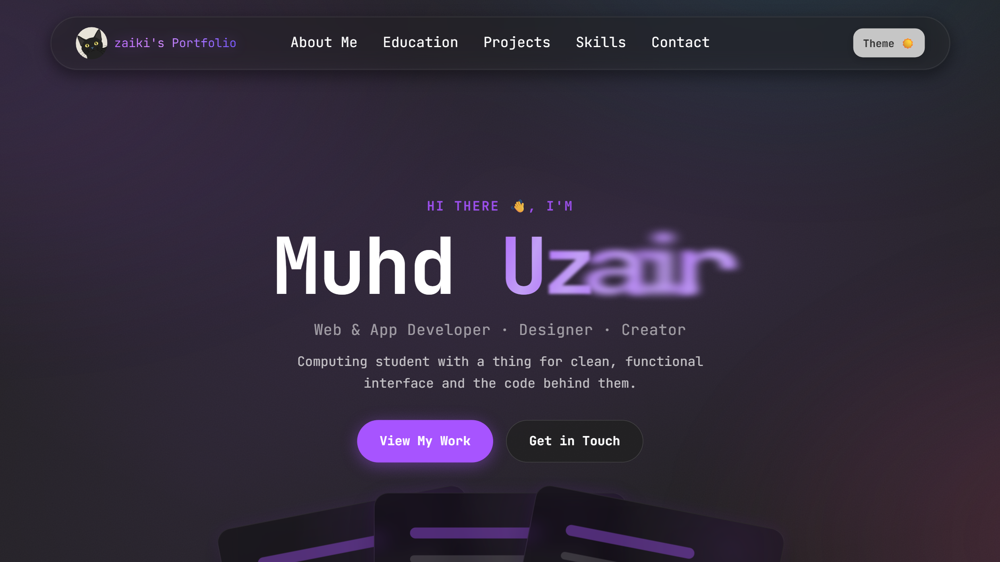
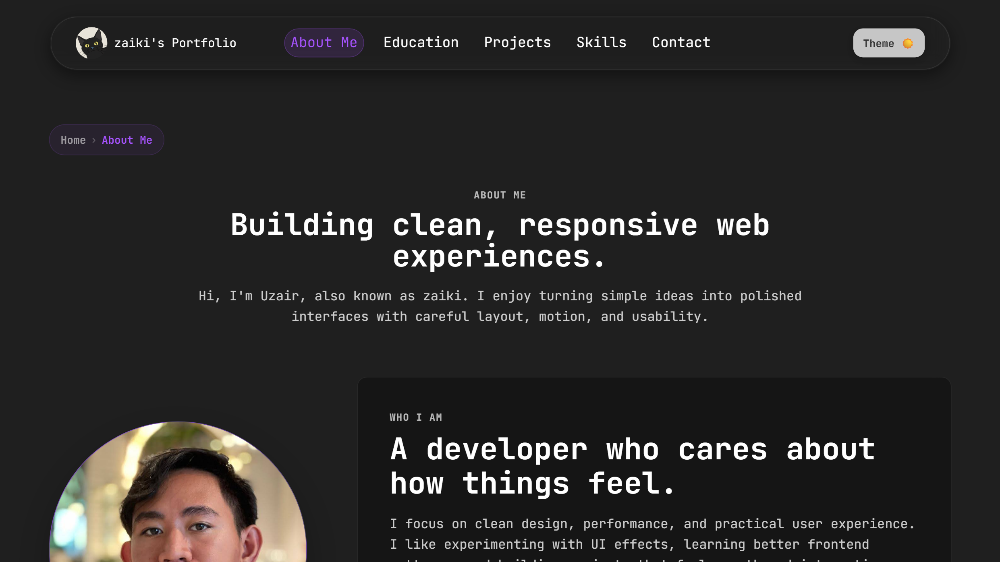
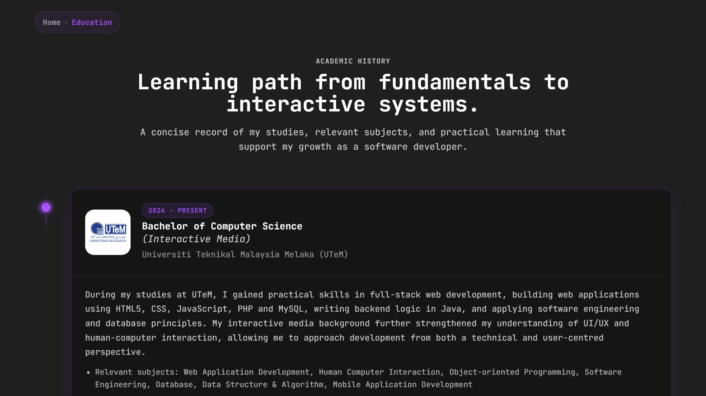
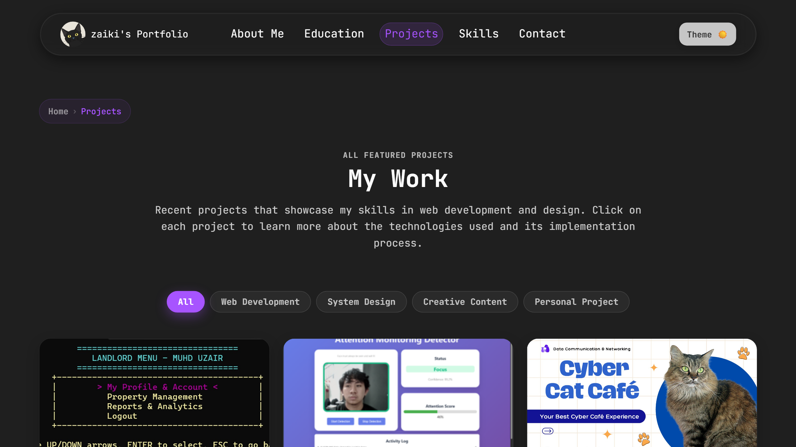
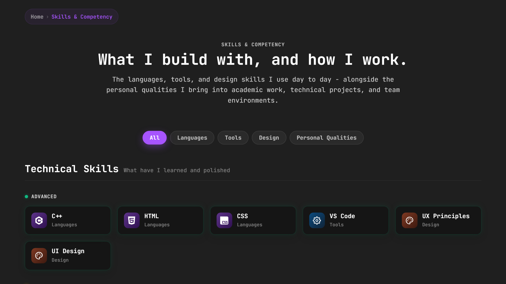
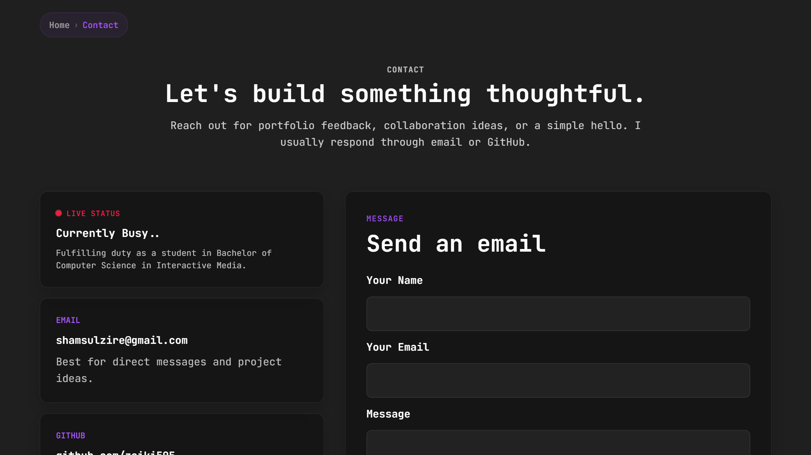

# Zaiki - Personal Developer Portfolio

A clean, responsive personal portfolio built with plain HTML, CSS, and JavaScript (no frameworks, no build tools). Designed to showcase my work, academic background, and technical skills as a computing student specialising in interactive media.

**Live site -> [zaiki.netlify.app](https://zaiki.netlify.app/)**

**Site Status -> **

## Overview

This portfolio was designed and developed from scratch without frameworks, libraries, or build tools. The project serves as both a personal showcase and a long-term professional portfolio for internships, networking, and future career opportunities.

The design emphasizes:
- Clean and modern aesthetics
- Strong visual hierarchy
- Responsive user experience
- Smooth interactions and animations
- Accessibility and readability
- Consistent design language

The design follows a dark-first approach with optional light mode support, subtle motion design, glassmorphism-inspired effects, and deliberate use of whitespace. The focus is on content clarity and smooth interaction without visual noise.

---

<h2>Portfolio Preview</h2>

  

  
  

  
  

  

---

## Key Features

### User Experience & Interface
- Fully responsive layout optimized for desktop, tablet, and mobile devices
- Light and dark theme support with persistent user preferences
- Floating navigation bar with adaptive sizing
- Breadcrumb navigation for improved wayfinding
- Mobile-friendly scroll-to-top button
- Consistent card-based information architecture
- Accessible typography and colour contrast
- Modern minimalist design approach

### Interactive Features
- Dynamic project category filtering
- Interactive skills categorization
- Animated navigation indicators
- Smooth page transitions
- Hover and click micro-interactions
- Expandable academic information sections
- Theme-aware interface elements
- Adaptive navigation transparency

### Academic Showcase
- Academic timeline
- Semester-by-semester CGPA tracker
- MUET achievement display
- SPM results breakdown
- Dean's List achievements
- Online resume with download support
- Dedicated project showcase pages

### Unique Features
**Interactive Cyber Cat**

A custom mascot integrated into the portfolio that responds to user interactions.

Features include:
- Cursor hover reactions
- Click interactions
- Theme-aware pupil animations

**Hero Section Effects**

The homepage includes:

- Animated gradient background
- Texture overlays
- Dynamic blur-wave title animation
- Smooth card transitions
- Glassmorphism-inspired interface elements

---

## Pages

| Page | Path | Description |
|---|---|---|
| Home | `index.html` | Hero section, short about snapshot, featured projects, and contact links |
| About | `about.html` | Full bio, profile photo, contact details, viewing resume, and current focus  |
| Education | `education.html` | Academic timeline (UTeM, UiTM, IQKL), CGPA tracker, SPM results, MUET band, and notable achievements |
| Projects | `projects.html` | Full project listing with category filter |
| Skills | `qualities.html` | Technical skills by tier (Advanced / Intermediate / Beginner) with category filter, plus personal qualities |
| Contact | `contact.html` | Live availability status, social links, and contact form |
| Resume | `resume.html` | Viewable resume with download option |
| 404 | `404.html` | Custom error page, matching the site design, served automatically by GitHub Pages |

### Project Detail Pages

Each project card links to a dedicated detail page in the `projects/` subfolder:

| Project | Path |
|---|---|
| Attention Monitoring Detector | `projects/Attention Detector.html` |
| House Rental Management System | `projects/Workshop 1.html` |
| Network Design for Cyber Cat Café | `projects/Network-design.html` |
| CineTrack: Smart Movie Tracker | `projects/CineTrack.html` |
| CS Training Centre Application | `projects/CS-TCA.html` |

---

## Tech Stack

| Layer | Technology |
|---|---|
| Markup | HTML5 |
| Styling | Vanilla CSS (custom properties, backdrop-filter, CSS animations) |
| Scripting | Vanilla JavaScript (no libraries) |
| Fonts | JetBrains Mono via Google Fonts |
| Hosting | GitHub Pages |

No npm, no bundler, no framework. The entire site runs by opening an HTML file in a browser.

---

## Deployment

The site is deployed via **GitHub Pages** from the `main` branch root. Any push to `main` triggers an automatic redeploy - no CI/CD configuration needed.

Custom 404 handling is provided by `404.html` in the repo root, which GitHub Pages serves automatically for any unmatched route.

---

## Academic Context

| Detail | |
|---|---|
| Degree | Bachelor of Computer Science (Interactive Media) |
| University | Universiti Teknikal Malaysia Melaka (UTeM) |
| Status | Ongoing - Year 2 of 3 |
| Dean's List | Semester 1, 2, and 3 |

The base layout of this portfolio was built independently before any coursework requirement, a personal project to establish a professional web presence early. It was later expanded in greater depth as part of a Human Computer Interaction (HCI) coursework project, adding additional pages, interactivity, and polish beyond what is required.

---

## Author

**Muhd Uzair** (zaiki), Selangor, Malaysia

- GitHub: [github.com/zaiki505](https://github.com/zaiki505)
- LinkedIn: [linkedin.com/in/muhd-uzair-473333378](https://www.linkedin.com/in/muhd-uzair-473333378/)
- Email: shamsulzire@gmail.com

---

## License

This repository is provided for learning, inspiration, and reference purposes.

You are welcome to study the code structure, implementation techniques, and design patterns used throughout the project. However, please do not directly copy, redistribute, or republish the portfolio content, assets, branding, or personal information as your own work.
